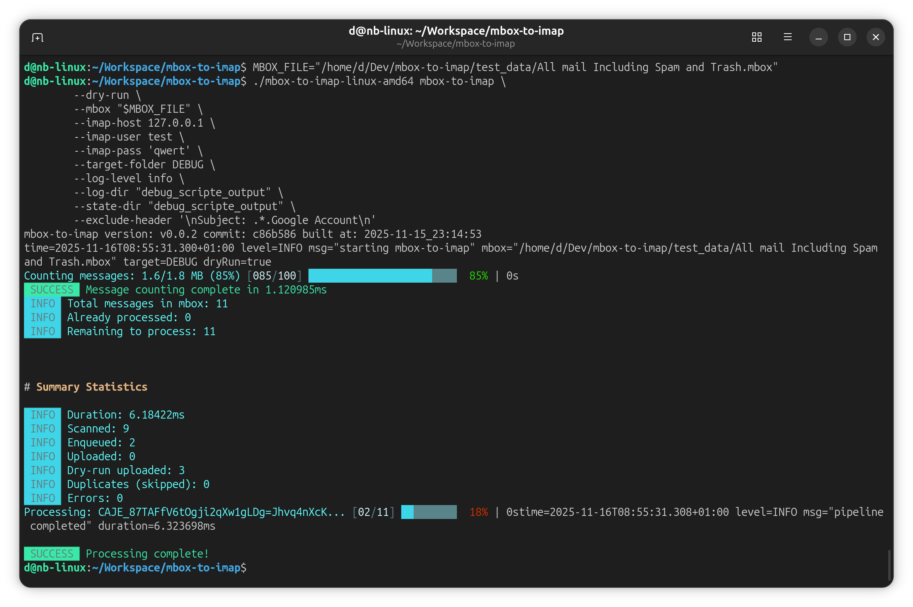
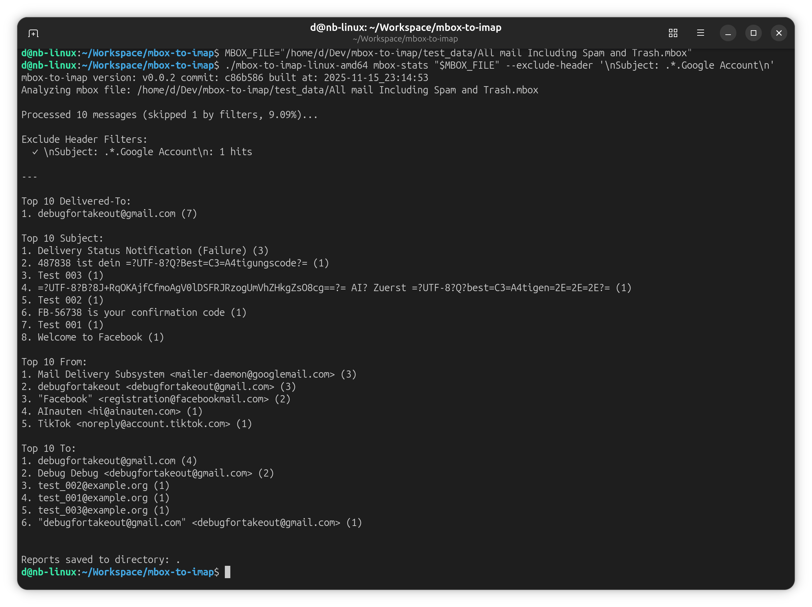

[](https://github.com/dhcgn/mbox-to-imap/actions/workflows/go.yml) [](https://codecov.io/gh/dhcgn/mbox-to-imap)
# mbox-to-imap

**mbox-to-imap** is a command-line tool written in **Go** for importing emails from an `mbox` file into an IMAP mailbox.  
It supports **repeatable, incremental synchronization** — only new, unsynchronized messages are transferred when run multiple times.  
It also includes a **filtering system (regex)** and an **dry-run** mode with stats.

Ideal for importing **Google Takeout** archives or migrating email data between providers.

The tool has been **validated end-to-end** on a personal Google Takeout export around **16 GB** in size.

Downloads: <https://github.com/dhcgn/mbox-to-imap/releases> (Windows and Linux)

---

## 🚀 Overview

`mbox-to-imap` provides two main commands:

1. **`mbox-to-imap`** - Import messages from `.mbox` files into an IMAP mailbox
2. **`mbox-stats`** - Analyze `.mbox` files and generate statistics without uploading

### Use Case: Google Takeout Migration

As a Google user, you can request an export of your entire mailbox from [Google Takeout](https://takeout.google.com/) in `.mbox` format. However, **there is no easy built-in option to upload this file to your new email provider**. This tool was specifically programmed to solve that problem — allowing you to migrate your Google Takeout mail archives to any IMAP-compatible email service, in my case I moved to [mailbox.org](https://mailbox.org/en/) a great mail provider based in Germany.

### Core Features

- Reliable `.mbox` → IMAP import
- Incremental sync (idempotent) with state tracking
- Stop and resume safely
- **Filtering via include *or* exclude (mutually exclusive) with regex rules**
- **Dry-run analysis** with counts and statistics
- **Standalone statistics tool** for mbox file analysis
- Generates CSV reports for senders, recipients, subjects

---

## ⚙️ Features

- **Incremental synchronization:** Avoid duplicate uploads using `sha256` tracking
- **Graceful resume:** Continue after interruption via state files (`processed.jsonl`)
- **Allow/deny filters:** Include-only (allow list) *or* exclude-some (block list)
- **Dry-run mode:** Preview sync operations with statistics
- **Statistics analysis:** Generate detailed reports without uploading
- **Cross-platform:** Pre-compiled releases for Linux and Windows
- **Lightweight:** No database, uses local JSONL state files to track transferred messages

---

## 📦 Installation

### Pre-compiled Releases (Recommended)

Download pre-compiled binaries for **Linux** and **Windows** from the [Releases](https://github.com/dhcgn/mbox-to-imap/releases) page.

### Build from Source

Requires **Go 1.20+**.

```bash
git clone https://github.com/dhcgn/mbox-to-imap.git
cd mbox-to-imap
go build -o mbox-to-imap
```

---

## 💡 Basic Usage

### Import MBOX to IMAP

```bash
./mbox-to-imap \
  --mbox /path/to/AllMail.mbox \
  --imap-host imap.example.com \
  --imap-port 993 \
  --imap-user user@example.com \
  --imap-pass "secret" \
  --target-folder "INBOX/Imported"
```

### Dry Run (Simulation + Stats)

Simulate synchronization, apply (optional) filters, and show **summary statistics**:

```bash
./mbox-to-imap \
  --mbox archive.mbox \
  --imap-host imap.example.com \
  --imap-user user@example.com \
  --imap-pass secret \
  --dry-run
```

Example (illustrative) dry-run output:

```
[Dry Run Summary]
Total messages scanned: 3500
Matched (after filters): 2300
Skipped (excluded or not allowed): 1200
Would upload: 2300

Top 10 Senders (From):
1) alice@example.com (410)
2) newsletters@service.com (350)
...

Top 10 Recipients (To):
1) me@example.com (1,540)
2) team@example.com (280)
...

Top 10 Subjects:
1) "Project X weekly sync" (42)
2) "Invoice April" (31)
...

Top 100 words in subjects (space-separated tokens):
project(120), invoice(85), april(50), weekly(48), sync(45), ...
```

> Tokenization for the “Top 100 words in subjects” is space-based; punctuation handling may evolve.

## 🖼️ Screenshots



Dry-run run of `mbox-to-imap` against `test_data/All mail Including Spam and Trash.mbox` while excluding Google Account notifications:

```bash
MBOX_FILE="/home/d/Dev/mbox-to-imap/test_data/All mail Including Spam and Trash.mbox"
./mbox-to-imap-linux-amd64 mbox-to-imap \
  --dry-run \
  --mbox "$MBOX_FILE" \
  --imap-host 127.0.0.1 \
  --imap-user test \
  --imap-pass 'qwert' \
  --target-folder DEBUG \
  --log-level info \
  --log-dir "debug_scripte_output" \
  --state-dir "debug_scripte_output" \
  --exclude-header '\nSubject: .*.Google Account\n'
```



`mbox-stats` inspection of the same sample mailbox with the identical exclude filter applied:

```bash
MBOX_FILE="/home/d/Dev/mbox-to-imap/test_data/All mail Including Spam and Trash.mbox"
./mbox-to-imap-linux-amd64 mbox-stats "$MBOX_FILE" --exclude-header '\nSubject: .*.Google Account\n'
```

---

## 🔧 Command-Line Options

### `mbox-to-imap` Command

| Flag                     | Description                                          | Default / Required      |
| ------------------------ | ---------------------------------------------------- | ----------------------- |
| `--mbox`                 | Path to `.mbox` file                                 | **required**            |
| `--imap-host`            | IMAP server hostname                                 | **required**            |
| `--imap-port`            | IMAP port                                            | `993`                   |
| `--imap-user`            | IMAP username                                        | **required**            |
| `--imap-pass`            | IMAP password (or use `IMAP_PASS` env var)          | **required**            |
| `--use-tls`              | Use TLS for IMAP connection                          | `true`                  |
| `--insecure-skip-verify` | Skip TLS certificate validation                      | `false`                 |
| `--target-folder`        | Target IMAP folder for imported mail                 | `INBOX`                 |
| `--state-dir`            | Directory for state files                            | `~/.mbox-to-imap/state` |
| `--dry-run`              | Simulate sync and print stats (no changes)           | `false`                 |
| `--log-level`            | Logging verbosity (`debug`, `info`, `warn`, `error`) | `info`                  |
| `--log-dir`              | Directory for log files (optional)                   | (none)                  |

### `mbox-stats` Command

| Flag             | Description                                                    | Default / Required |
| ---------------- | -------------------------------------------------------------- | ------------------ |
| (positional)     | Path to `.mbox` file                                           | **required**       |
| `--output`, `-o` | Output directory for CSV reports                               | `.` (current dir)  |
| `--top`, `-t`    | Number of top items to display in statistics                   | `10`               |

<details>
<summary><b>View full help output</b></summary>

```
$ mbox-to-imap mbox-to-imap --help
Import messages from mbox archives into an IMAP mailbox

Usage:
  mbox-to-imap mbox-to-imap [flags]

Flags:
      --dry-run                      Simulate the sync and emit stats without uploading
      --exclude-body stringArray     Regex block-list applied to message bodies (mutually exclusive with include flags)
      --exclude-header stringArray   Regex block-list applied to message headers (mutually exclusive with include flags)
  -h, --help                         help for mbox-to-imap
      --imap-host string             IMAP server hostname
      --imap-pass string             IMAP password (falls back to IMAP_PASS env var)
      --imap-port int                IMAP server port (default 993)
      --imap-user string             IMAP username
      --include-body stringArray     Regex allow-list applied to message bodies (mutually exclusive with exclude flags)
      --include-header stringArray   Regex allow-list applied to message headers (mutually exclusive with exclude flags)
      --insecure-skip-verify         Skip TLS certificate verification (not recommended)
      --log-dir string               Optional directory where log files will be written
      --log-level string             Logging level: debug, info, warn, error (default "info")
      --mbox string                  Path to the .mbox file to import
      --state-dir string             Directory for incremental sync state files (default "/home/d/.mbox-to-imap/state")
      --target-folder string         Target IMAP folder for imported mail (default "INBOX")
      --use-tls                      Use TLS for the IMAP connection (default true)
```

```
$ mbox-to-imap mbox-stats --help
Analyse the mbox file and show statistics

Usage:
  mbox-to-imap mbox-stats [mbox file] [flags]

Flags:
      --exclude-body stringArray     Regex block-list applied to message bodies (mutually exclusive with include flags)
      --exclude-header stringArray   Regex block-list applied to message headers (mutually exclusive with include flags)
  -h, --help                         help for mbox-stats
      --include-body stringArray     Regex allow-list applied to message bodies (mutually exclusive with exclude flags)
      --include-header stringArray   Regex allow-list applied to message headers (mutually exclusive with exclude flags)
  -o, --output string                Output directory for CSV reports (default ".")
  -t, --top int                      Number of top items to display in statistics (default 10)
```

</details>

### Filtering (mutually exclusive modes)

Both `mbox-to-imap` and `mbox-stats` commands support the same filtering options:

> You can use **include** *or* **exclude**, **not both**.
> All filter values are **regex**.
> "Header" checks search across the raw header block (e.g., `From:`, `To:`, `Cc:`, `Subject:` etc.).
> "Body" checks search the message body text.

**Include-only (allow list):** Only messages matching at least one include rule are considered; all others are **dropped**.

* `--include-header "<regex>"`
* `--include-body "<regex>"`

**Exclude-some (block list):** All messages are included **except** those matching any exclude rule.

* `--exclude-header "<regex>"`
* `--exclude-body "<regex>"`

You may provide each flag multiple times to add multiple rules. Use `\n` to match newlines in headers.

---

## 🧱 Filtering Examples

### Allow list (include-only)

Only include mails from a domain **and** with "Project X" in the subject or body:

```bash
./mbox-to-imap mbox-to-imap \
  --mbox mails.mbox \
  --imap-host imap.server.com \
  --imap-user user@domain.com \
  --imap-pass "$IMAP_PASS" \
  --include-header "From:\s*.*@trusted\.com" \
  --include-header "Subject:\s*.*Project X.*"
# Using include mode means only messages matching ANY include regex are kept.
```

### Block list (exclude-some)

Exclude newsletters and mails with "unsubscribe" in the body:

```bash
./mbox-to-imap mbox-to-imap \
  --mbox mails.mbox \
  --imap-host imap.server.com \
  --imap-user user@domain.com \
  --imap-pass "$IMAP_PASS" \
  --exclude-header "Subject:\s*.*(newsletter|promo).*" \
  --exclude-body "(?i)unsubscribe"
```

### Advanced multi-filter example

Exclude various automated notifications, alerts, and unwanted senders:

```bash
./mbox-to-imap mbox-to-imap \
  --mbox "archive.mbox" \
  --imap-host imap.provider.com \
  --imap-user user@example.com \
  --imap-pass "$IMAP_PASS" \
  --target-folder "INBOX/Imported" \
  --exclude-header '\nTo: .*notifications@noreply.github.com.*\n' \
  --exclude-header '\nFrom: .*alerts-noreply@google.com.*\n' \
  --exclude-header '\nFrom: .*jobalerts-noreply@linkedin.com.*\n' \
  --exclude-header '\nSubject: Smart Home Alert.*\n' \
  --exclude-header '\nSubject: .*Newsletter.*\n' \
  --exclude-header '\nDelivered-To: spam-folder@example.com\n'
```

> **Rule semantics:**
>
> * **Include mode:** keep if `include-header` **OR** `include-body` matches (allow list). Everything else is dropped.
> * **Exclude mode:** drop if `exclude-header` **OR** `exclude-body` matches; otherwise keep.

### Filtering Tips

**Important:** Header filters process the **entire header block as a single string**, including newlines. This means:

- Use `\n` in your regex patterns to match across header lines
- Be mindful of whitespace and line breaks in multi-line headers
- Test your filters thoroughly before running a full import

**Testing filters:** Use `mbox-stats` to test your filter rules before uploading:

```bash
./mbox-to-imap mbox-stats archive.mbox \
  --exclude-header '\nFrom: .*@spam.com.*\n' \
  --top 20
```

This shows you exactly what will be included/excluded without touching your IMAP server.

**Note on encoded subjects:** Some subject lines appear encoded (e.g., `=?UTF-8?B?...?=`) rather than human-readable. These can be decoded using standard MIME header decoding tools if needed for analysis.

---

## 🔁 Incremental Synchronization

* Each `.mbox` sync uses a **state file** (`processed.jsonl`) to track transferred messages.
* Already-synced messages (by `sha256`) are skipped.
* If the tool is stopped mid-transfer, it resumes from the last checkpoint.

Mechanism:

1. Identify messages by `sha256`.
2. Record successfully transferred message IDs in `processed.jsonl` (one JSON object per line).
3. On subsequent runs, skip messages whose IDs are in the state file.

**State file format** (`processed.jsonl`):
```json
{"hash":"nEpZ/rndGF66KIhZ8NtxGtvL6wE1QKqaxt+4Kncm0oU=","message_id":"ff64b0d3-7c62-4b9b-9aa4-45619ed0d2ac@facebookmail.com"}
```

Each line contains:
- `hash`: SHA-256 hash of the message content
- `message_id`: Original Message-ID header from the email, there are cases where their are duplicates!

### Important: Client-Side State Only

**Upload state is stored only on the client side** in the local `processed.jsonl` file. The tool does not query the IMAP server to check for existing messages. This means:

- If you delete the state file, the tool will attempt to re-upload all messages
- If you run the tool from different machines without syncing state files, duplicates may occur
- Future versions may support server-side duplicate detection via `Message-ID` queries, but currently **only the local JSONL file prevents duplicate uploads**

---

## 🧪 Logging & Stats

* `--dry-run` **always** produces a stats summary:

  * Total scanned / enqueued / uploaded / dry-run uploaded
  * Duplicates (skipped)
  * Errors
  * Duration
* `mbox-stats` generates detailed reports:
  * Top senders (From)
  * Top recipients (To, Delivered-To)
  * Top subjects
  * CSV exports for all statistics, saved in folder: `-o, --output string                Output directory for CSV reports (default ".")`
  * Filter hit statistics
* `--log-level debug` enables message-by-message tracing
* `--log-level info` shows progress bars and summary statistics

---

## 🔒 Security Recommendations

* Always back up `.mbox` files before running imports.
* Use environment variables or app passwords:

  ```bash
  export IMAP_PASS="secret"
  ./mbox-to-imap mbox-to-imap --imap-pass "$IMAP_PASS"
  ```
* Keep state files private (may contain metadata).
* Avoid `--insecure-skip-verify` except for debugging in trusted environments.


## 🧪 Untested Features

- `--insecure-skip-verify`: Skipping TLS certificate validation is discouraged and currently untested against live servers.
- `--use-tls=false`: Running the importer without TLS has not been validated; expect TLS-enabled connections.


## 🚫 Limitations

- Folder hierarchies inside the source `.mbox` are not replicated; all uploads target a single IMAP folder.
- Sync state is purely local. Removing `processed.jsonl` (or switching machines without copying it) causes previously ingested messages to upload again.
- Timestamps are set to the time when the message is uplaoded via imap. The original email date is not preserved.

---

## ⚠️ Disclaimer

**This software is provided "as is" without warranty of any kind, express or implied.**

There is **NO WARRANTY WHATSOEVER** when using this tool. The authors and contributors make no guarantees about its functionality, reliability, or suitability for any purpose.

Use at your own risk — the authors assume **no liability** for any damage, data loss, corruption, or other issues that may arise from using this software.

**Always:**
- Back up your `.mbox` files before processing
- Test with a small sample mailbox before large migrations
- Verify results after import

---

## 📋 Project Scope

This tool was built to solve **my specific use case** for migrating Google Takeout archives. If it doesn't perfectly fit your needs, feel free to **fork the repository** and adapt it to your requirements. You're welcome to open an issue, but please understand that the project is maintained primarily for personal use.

---

## 🧑‍💻 Development

Contributions are welcome!

```bash
# Run tests
go test ./...
```

Please format code (`go fmt`) and lint before submitting PRs.

### Performance Notes

The current implementation is **single-threaded**. Initial development focused on **functionality over performance** — ensuring reliable, idempotent synchronization was the priority. There is significant room for performance optimization in future versions through parallel processing of messages.

---
## Usefull cli linux commands handling google takeout

```bash
echo "Count all mails ..."
MBOX="test_data/All mail Including Spam and Trash.mbox"
rg -a "^Delivered-To: " "$MBOX" | wc -l
```

## 🪪 License

MIT License
